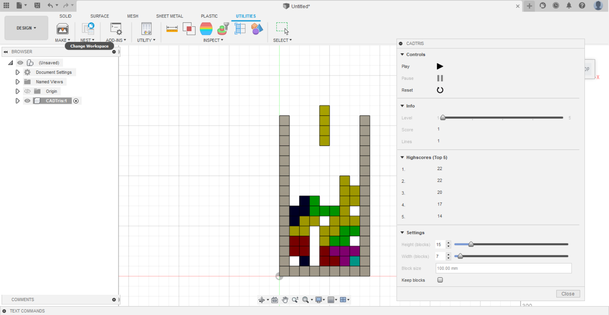
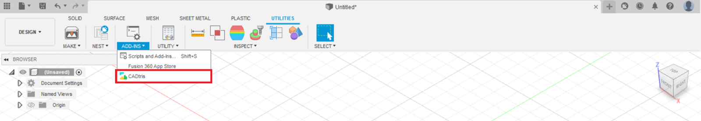

# CADTris
This addin allows you to play a variation of the famous puzzle game. 
All the blocks which get created during playing the game are real Fusion360 bodies so you can use them in your CAD model if you like.

The button/command to start the game is created in the addins panel in the tools tab. By default its not pinned to the toolbar.

## Settings
### Height (blocks)
The height of the field in blocks. The minimum are 9 blocks and the maximum are 50 blocks. Can only be changed when the game is in its initial state.

### Width (blocks)
The width of the field in blocks. The minimum are 6 and the maximum are 25 blocks. Can only be changed when the game is in its initial state.

### Block Size
Specifies the side length of the blocks. This is only important if you keep the bodies and plan to use them in your CAD model somehow.

### Keep Blocks
If this option is set all the bodies you can see while playing are kept in a new component after leaving the game.

## Info Group
### Highscores
The best scores you achieved so far. If you can break n lines with one brick you get n**2 points for your score

### Level
The current level of the game. The higher the level the faster the game. After 6 broken lines the level gets incremented.

### Lines
The number of full lines you managed to achieved in this game so far

## Privacy Policy
This addin saves your achieved highscores in a single local file on your computer. Except from this the addin does not collect or use any user data. There are no third parties who might collect data. You can see and/or delete the saved highscores by checking out the folder C:\Users\user_name\AppData\Local\CADTris.

## Known Issues
When running the addin in debug mode their might occur some errors in displaying the voxels.
Some voxels are still shown even if the bodies are deleted already. This might be due to some issues with wrong or missing locks or a bug in the Fusion API.
However when running the addin normally no errors appeared during multiple tests.   